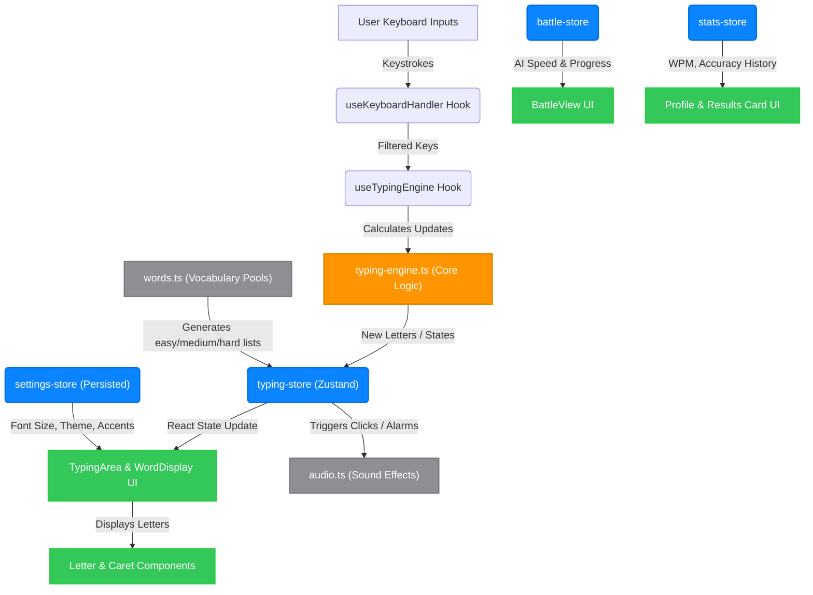
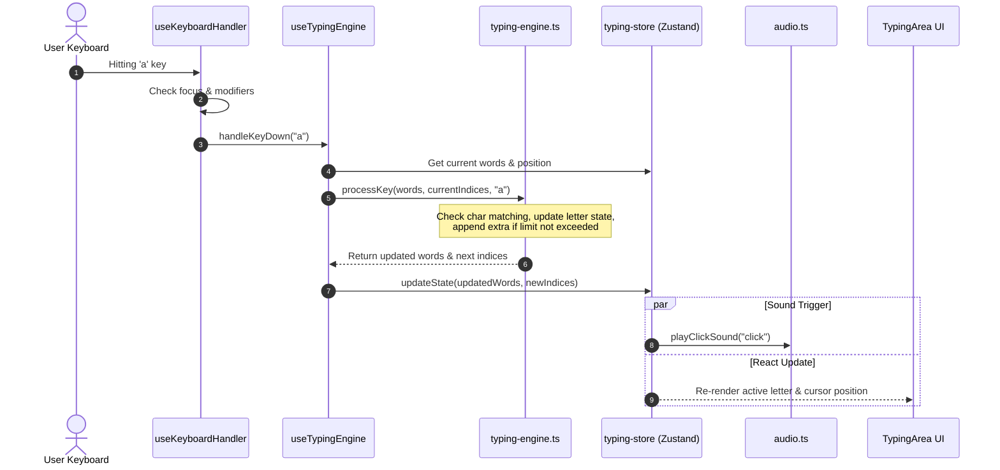

# TypeForge 

TypeForge is a premium, minimalist speed-typing application styled in accordance with **Apple's Human Interface Guidelines (HIG)**. Built with React, Next.js, Tailwind CSS, and Zustand, it provides a typing trainer with multiple game modes, detailed statistics, customizable settings, and local database persistence.

---

## Getting Started

Follow these steps to run the application locally on your machine.

### Prerequisites
Make sure you have **Node.js** (v18.x or later) installed on your system.

### 1. Install Dependencies
Clone the repository, navigate to the folder, and run:
```bash
npm install
```

### 2. Run the Development Server
Start the Next.js dev server:
```bash
npm run dev
```
Open http://localhost:3000 in your browser to start typing.

### 3. Verify Code / Typecheck
Ensure all TypeScript definitions and configurations compile cleanly:
```bash
npx tsc --noEmit
```

### 4. Build for Production
To build the static server bundle and start it:
```bash
npm run build
npm run start
```

---

## Features

### Game Modes
TypeForge supports multiple typing styles:
```bash
words   # Standard word-count benchmarks (15, 25, 50, 75)
timed   # Practice under a countdown clock (15s, 30s, 60s, 120s)
battle  # Race head-to-head against a customizable AI opponent cursor
drill   # Build custom typing drills targeted to character clusters
yolo    # Single-mistake survival mode with active multiplier streaks
```

### Word Difficulty System
Select from Easy (top 1,000 common English words), Medium (top 5,000 words), and Hard (full 10,000-word vocabulary) pools dynamically.

### Backspace to Previous Word
Press Backspace at the beginning of a word to return and correct the previous word, only if that previous word contains typing mistakes.

### Analytics & Heatmaps
Review WPM speed history, accuracy charts, and a visual keyboard heatmap displaying typing error densities.

### Sound Feedback
Mechanical click and click-bell sound effects powered by the high-performance Web Audio API.

---

## System Architecture

TypeForge follows a decoupled unidirectional state flow powered by Zustand stores, custom hooks, and pure logic layers.

### Architectural Flowchart



### Keystroke Data Lifecycle



---

## Codebase Layout

```txt
├── app/                  # Next.js App Router folders (pages & routing)
│   ├── page.tsx          # Main typing dashboard orchestrator
│   ├── settings/         # Persisted UI configurations view
│   └── profile/          # Accuracy heatmaps & metrics history view
├── components/           # UI components
│   ├── typing/           # Word list & letter canvas render blocks
│   ├── battle/           # Real-time AI opponent visual bar
│   ├── stats/            # Analytics charts and results sliders
│   └── ui/               # Apple HIG modular buttons, sliders, & lists
├── stores/               # Zustand global state machines
│   ├── typing-store.ts   # Active words, keystroke lists, game timer states
│   ├── settings-store.ts # Persistent styles, difficulty levels, sound toggles
│   └── battle-store.ts   # Opponent speed benchmarks
├── engine/               # Pure, headless TypeScript algorithms
│   └── typing-engine.ts  # Input key transitions, spacebar rules, and backspaces
└── lib/                  # Helper modules & constant dictionaries
    ├── words.ts          # Sanitized word dictionaries & boost algorithms
    └── audio.ts          # Web Audio haptic click synthesis
```
